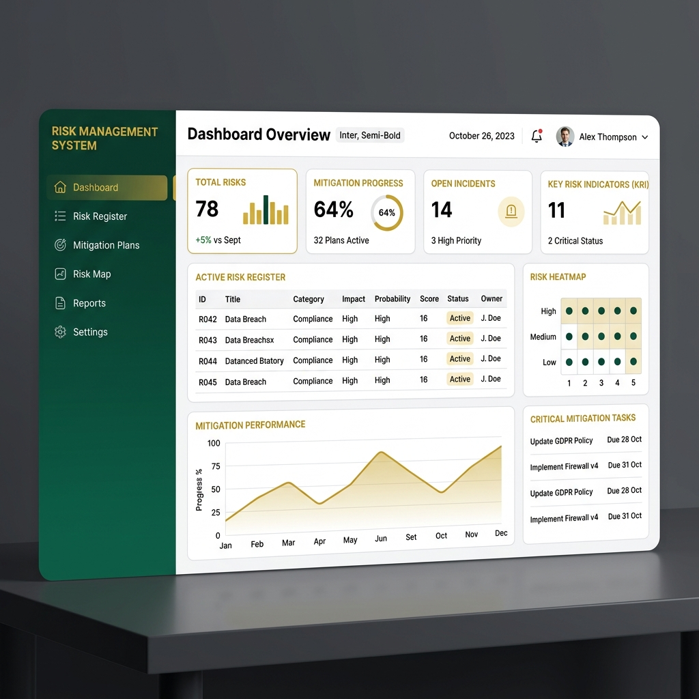
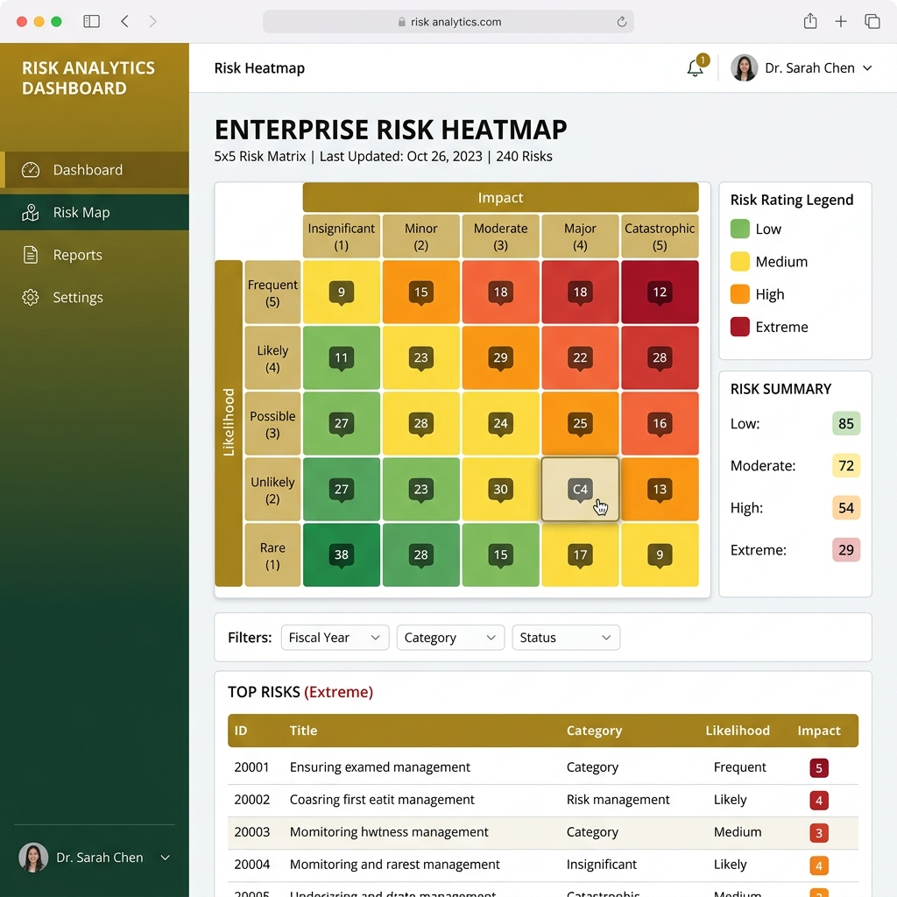
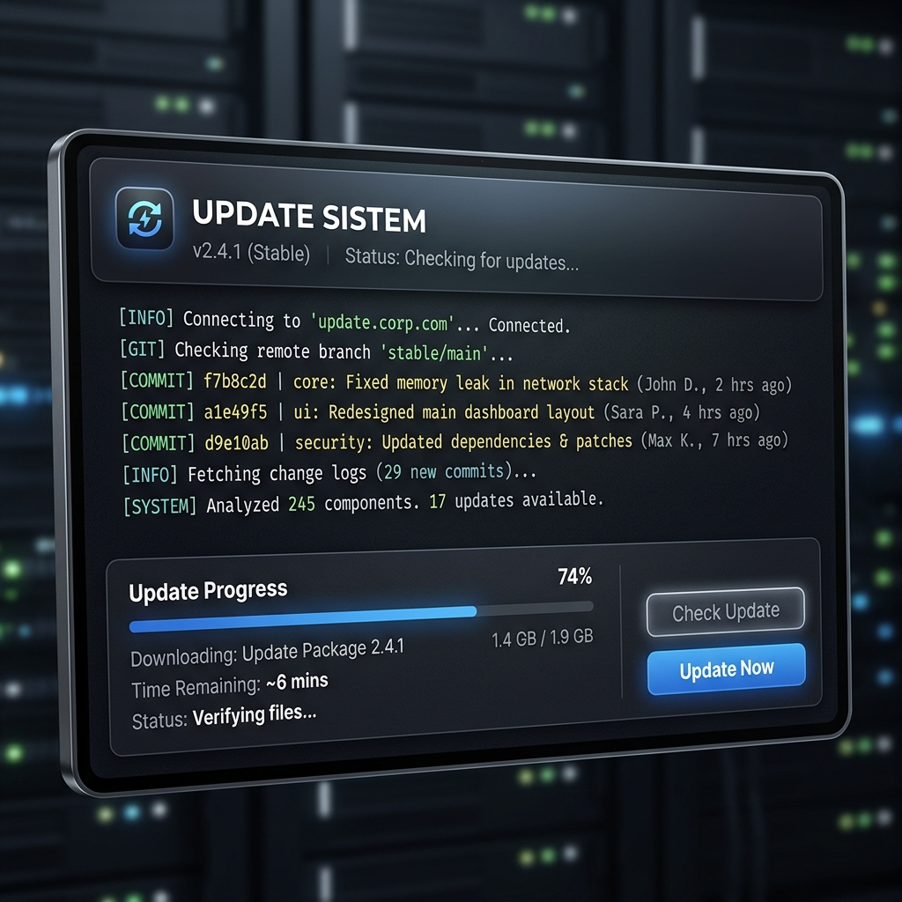

# Sistem Manajemen Risiko (Risk Management System)
## UIN Siber Syekh Nurjati Cirebon



Sistem Manajemen Risiko adalah aplikasi berbasis web yang dirancang untuk membantu institusi dalam mengidentifikasi, menganalisis, memitigasi, dan memantau risiko secara terstruktur dan digital. Aplikasi ini dibangun menggunakan framework Laravel dengan standar keamanan dan performa tinggi.

---

## 📸 Preview Aplikasi

| Dashboard Utama | Analisis Heatmap (5x5) |
|:---:|:---:|
|  |  |

| Modul Update Sistem | Monitoring & Realisasi |
|:---:|:---:|
|  | *Detail Realisasi & Monitoring* |

---

## 🌟 Fitur Utama

### 1. Dashboard Eksekutif
Visualisasi statistik risiko secara real-time, termasuk status mitigasi, tingkat risiko residual, dan ringkasan aktivitas monitoring.

### 2. Identifikasi Risiko (Risk Register)
Pencatatan risiko yang mencakup sasaran strategis, indikator kinerja, akar penyebab (*causa*), dan dampak risiko.

### 3. Analisis & Evaluasi Risiko
- **Heatmap Interaktif:** Peta risiko (5x5) untuk melihat sebaran risiko *Inherent* dan *Residual*.
- **Scoring System:** Kalkulasi otomatis level risiko berdasarkan probabilitas dan dampak.

### 4. Mitigasi Risiko
Perencanaan langkah-langkah pengendalian risiko lengkap dengan penetapan Penanggung Jawab (PIC) dan target waktu.

### 5. Monitoring & Realisasi
Pemantauan progres mitigasi secara berkala, pencatatan catatan perkembangan, dan evaluasi efektivitas kontrol untuk menurunkan level risiko.

### 6. Pelaporan Dinamis
- **Export PDF:** Laporan Risk Register formal yang dilengkapi dengan grafik distribusi kategori dan dampak indikator kinerja.
- **Export Excel:** Rekapitulasi data mentah untuk keperluan analisis lanjut.

### 7. Sistem Update & Maintenance
Modul khusus bagi administrator untuk melakukan pembaruan kode aplikasi langsung dari repositori GitHub (One-Click Deploy).

---

## 🛠 Teknologi Utama
- **Backend:** PHP 8.2+ dengan Laravel 12
- **Frontend:** AdminLTE 3, TailwindCSS, Bootstrap 4
- **Database:** MySQL / MariaDB
- **Reporting:** Barryvdh DomPDF & Maatwebsite Excel
- **Security:** Spatie Permission (Role Based Access Control)

---

## 🚀 Panduan Instalasi (Development)

1. **Clone Repositori**
   ```bash
   git clone https://github.com/riyantoabuwinner/riskmanagement.git
   ```

2. **Instal Dependensi PHP**
   ```bash
   composer install
   ```

3. **Konfigurasi Environment**
   Salin file `.env.example` menjadi `.env` dan sesuaikan konfigurasi database Anda.
   ```bash
   cp .env.example .env
   php artisan key:generate
   ```

4. **Migrasi Database & Seeding**
   ```bash
   php artisan migrate --seed
   ```

5. **Jalankan Aplikasi**
   ```bash
   php artisan serve
   ```

---

## 📦 Panduan Deployment & Update (Live)

Aplikasi ini dilengkapi dengan modul **Update Sistem** untuk memudahkan pemeliharaan di server produksi:

1. Pastikan server memiliki akses `git` ke repositori ini.
2. Login sebagai **Super Admin**.
3. Masuk ke menu **Sistem > Update Sistem**.
4. Klik **Cek Pembaharuan** untuk melihat apakah ada kode terbaru.
5. Klik **Perbarui Sekarang** untuk melakukan `git pull` dan pembersihan cache secara otomatis.

> **Catatan Penting:** Untuk perubahan struktur database (migration), developer harus menjalankannya secara manual melalui terminal server demi keamanan data.

---

## 📄 Lisensi
Sistem ini dikembangkan khusus untuk lingkungan **UIN Siber Syekh Nurjati Cirebon**. Seluruh hak cipta dilindungi.

---
**Pustikom UIN Siber Syekh Nurjati Cirebon**
Website: [https://uinssc.ac.id](https://uinssc.ac.id)

### 📞 DUKUNGAN TEKNIS
Jika Anda menemukan bugs, kendala login, atau kesalahan database, jangan panik dan jangan gaduh ataupun mencari-cari kesalahan tim pengembang. Segera screenshot dan kirimkan laporan ke:

📧 **pustikom@uinssc.ac.id**
#SilentHustle
